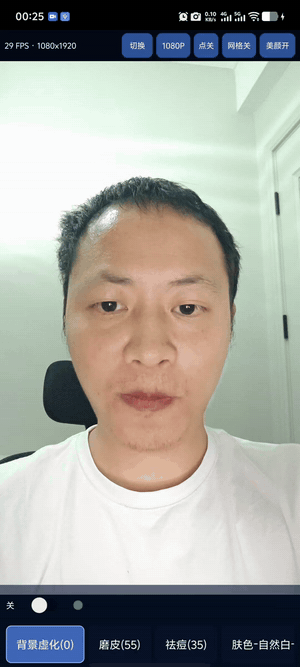
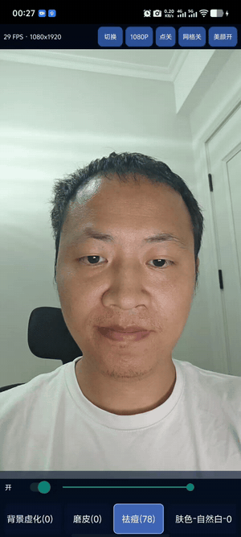
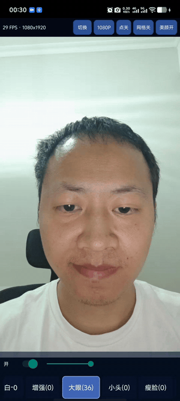
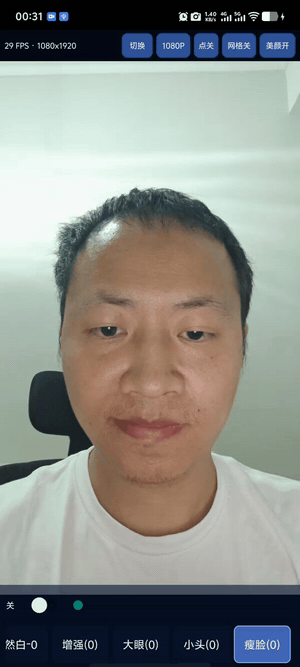
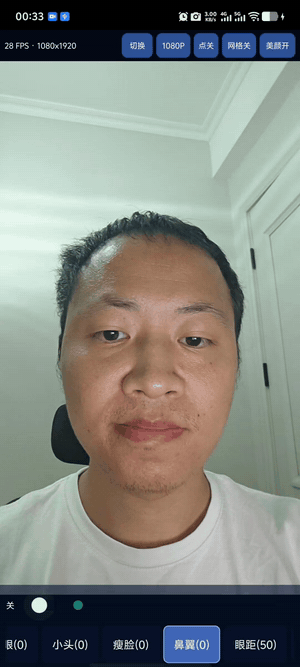
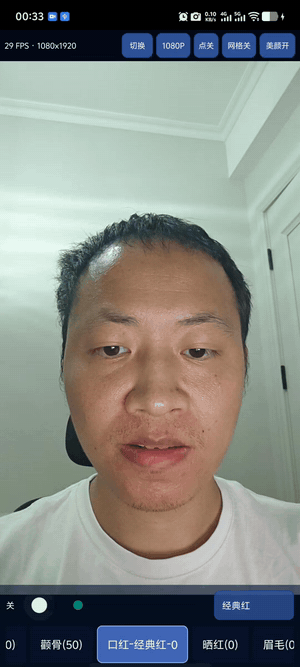
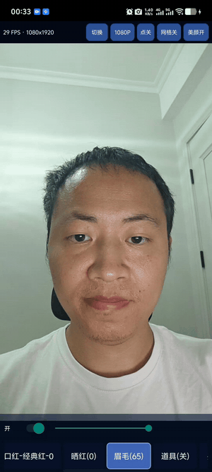
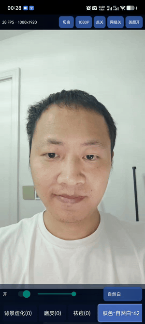

# MediaVision · Moon

**跨平台实时人像视觉 SDK**  
Android / iOS / Windows / macOS / Linux · `com.moon.mediavision`

中文 | [English](README.en.md)

MediaVision 提供美颜、面部塑形、美妆和背景处理，支持移动端应用与 C/C++ 集成，适用于相机、视频、直播和视频会议。

**发布的 SDK 可以免费商用。**

## 功能与计划

“优化中”表示已有功能，正在改善效果或性能；计划功能按表中顺序开发。

| 类别 | 功能 | 完成情况 | 优化计划 |
|---|---|---|---|
| 背景 | 人物分割 | 已支持 | 头发与动态边缘 |
| 背景 | 背景虚化 / 强度调节 | 优化中 | 减少闪烁与脸部清晰带 |
| 背景 | 图片背景替换 | 已支持 | 遮挡与颜色融合 |
| 背景 | Mask 查看 | 已支持 | 预览与诊断体验 |
| 背景 | 遮罩平滑 | 已支持 | 稳定性与响应速度 |
| 肤质 | 磨皮 | 已支持 | 保留皮肤纹理 |
| 肤质 | 祛痘 | 优化中 | 两端效果与 GPU 效率 |
| 肤质 | 美白 | 已支持 | 自然肤色与局部保护 |
| 肤质 | 自然白 / 冷白 / 红润 / 美黑 | 已支持 | 光照与肤色适配 |
| 画质 | 锐化 | 已支持 | 噪声与边缘控制 |
| 塑形 | 大眼 | 已支持 | 姿态与眼部保护 |
| 塑形 | 小头 | 优化中 | 虚化边缘与光晕 |
| 塑形 | 瘦脸 | 已支持 | 动态轮廓自然度 |
| 塑形 | 鼻翼调节 | 已支持 | 侧脸与局部变形 |
| 塑形 | 眼间距调节 | 已支持 | 极值与姿态稳定性 |
| 塑形 | 颧骨调节 | 优化中 | 背景边缘对齐 |
| 美妆 | 口红 / 颜色 / 强度 | 优化中 | 嘴部遮挡与边缘贴合 |
| 美妆 | 腮红 | 已支持 | 位置与自然融合 |
| 美妆 | 眉毛加深 | 已支持 | 毛发细节与遮挡 |
| 道具 | 基础网格道具 | 基础版 | 更丰富的模型与材质 |
| 道具 | 头饰 | 基础版 | 姿态跟随与遮挡 |
| 道具 | 首饰 | 基础版 | 锚点与动态稳定性 |
| 调试 | 人脸关键点 | 已支持 | 精度与跟踪稳定性 |
| 调试 | 人脸网格 | 已支持 | 显示效率与遮挡 |
| Demo | 效果总开关 / 独立强度 | 已支持 | 交互一致性 |
| Demo | 帧率 / 分辨率 / 相机切换 | 已支持 | 持续性能与预览体验 |
| 输入 | 图片 / 视频 / 摄像头 | 已支持 | 各平台输入链路完善 |
| 接入 | Android / iOS / Windows / macOS / Linux | 已提供 | 平台效果一致性 |
| 接入 | C / C++ 与移动端 API | 已支持 | 接入示例与封装 |
| 接入 | 自定义效果回调 | 已支持 | 扩展能力与示例 |
| 加速 | GPU 渲染与处理 | 已支持 | 减少拷贝与 CPU 工作 |
| 加速 | 模型后端选择 / 芯片适配 | 适配中 | NPU / GPU 模型与回退 |
| 性能 | 低端 iPhone 实时处理 | 优化中 | 480p/30 FPS、720p/25 FPS |
| 计划 1 | 瞳孔大小调节 | 待开发 | 瞳孔区域精细缩放 |
| 计划 2 | 额头宽窄调节 | 待开发 | 自然轮廓与发际线衔接 |
| 计划 3 | 美瞳佩戴 | 待开发 | 纹理贴合与眼睑遮挡 |
| 计划 4 | 墨镜佩戴 | 待开发 | 姿态跟随与真实遮挡 |
| 计划 5 | 法令纹变淡 | 待开发 | 局部纹理保护 |
| 计划 6 | 牙齿美白 | 待开发 | 牙齿区域隔离与自然提亮 |
| 计划 7 | 黑眼圈调节 | 待开发 | 眼周肤色融合 |
| 计划 8 | 发际线调节 | 待开发 | 头发边缘自然融合 |
| 计划 9 | 发量调节 | 待开发 | 头发结构与动态稳定性 |

## 效果对比

循环 GIF 可直接查看，保留原始对比过程。

| 效果对比 | 效果对比 |
|---|---|
| **美颜总开关**<br> | **祛痘**<br> |
| **大眼**<br> | **瘦脸**<br> |
| **鼻翼**<br> | **口红**<br> |
| **眉毛**<br> | **美白**<br> |

## Android 接入

保留 `google()` 和 `mavenCentral()`，添加以下仓库和依赖：

```groovy
// settings.gradle → dependencyResolutionManagement.repositories
maven { url 'https://jitpack.io' }

// app/build.gradle
implementation 'com.github.qmy1990:MediaVision:0.4.1'
```

Java 包名为 `com.moon.mediavision`：

```java
VisionSdk sdk = new VisionSdk(context, VisionSdk.AUTO);
sdk.configure(VisionOptions.builder()
    .beauty(0.55f).blemishRemoval(0.35f).build());
```

相机接入示例见 [Android Demo](demos/android)，完整配置见 [接入文档](docs/MAVEN.md)。支持 Android API 26+。

## iOS / C++ 接入

**iOS 15+**：将 `sdk/ios/MediaVisionSDK.xcframework` 加入工程并设置 Embed & Sign，将 `models/ios/mediavision.mvsmodels` 加入 App 资源。使用自己的开发团队签名运行 [iOS Demo](demos/ios)。

**C / C++**：使用 `include/mvs/` 公共头文件与对应平台库；最小示例见 [C++ Demo](demos/cli/main.cpp)。

详细用法见 [集成指南](docs/INTEGRATION.md)，平台与验证情况见 [平台说明](docs/PLATFORMS.md)。

## 获取 SDK 与 Demo

安装 [Git LFS](https://git-lfs.com) 后下载完整文件：

```bash
git lfs install
git clone https://github.com/qmy1990/MediaVision.git
```

SDK 位于 `sdk/`，Demo 位于 `demos/`，安装包位于 `installers/`。直接下载源码 ZIP 的使用方法见 [集成指南](docs/INTEGRATION.md)。
